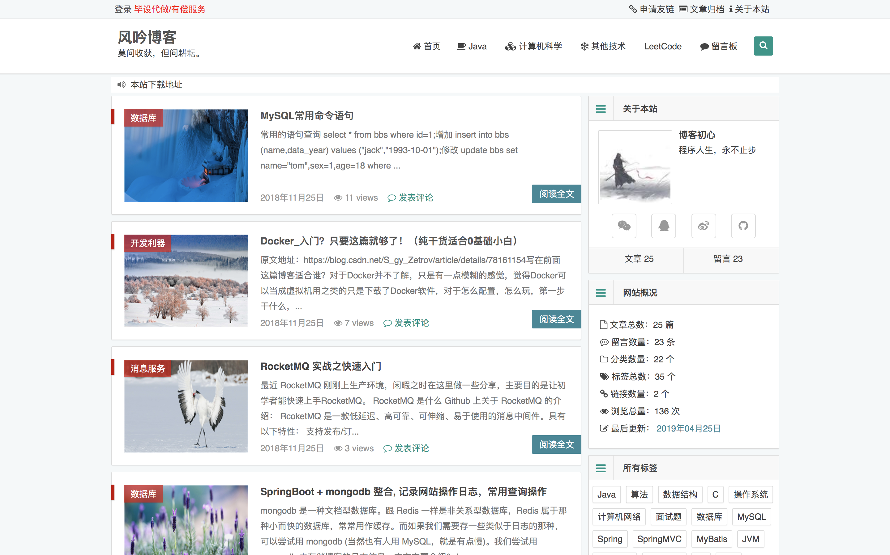
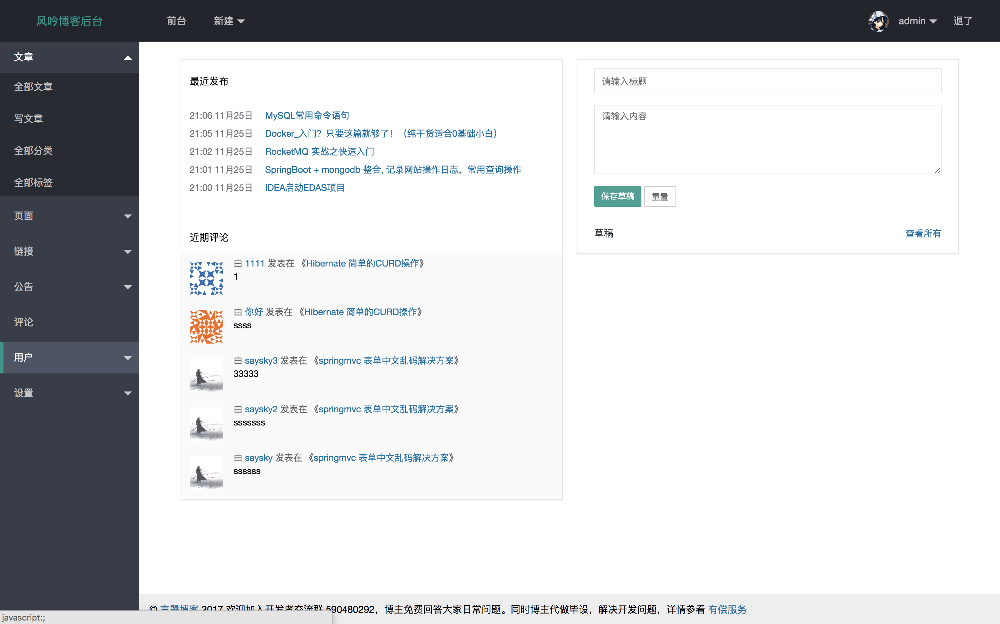
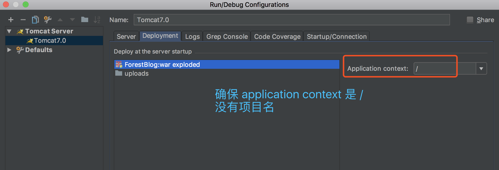
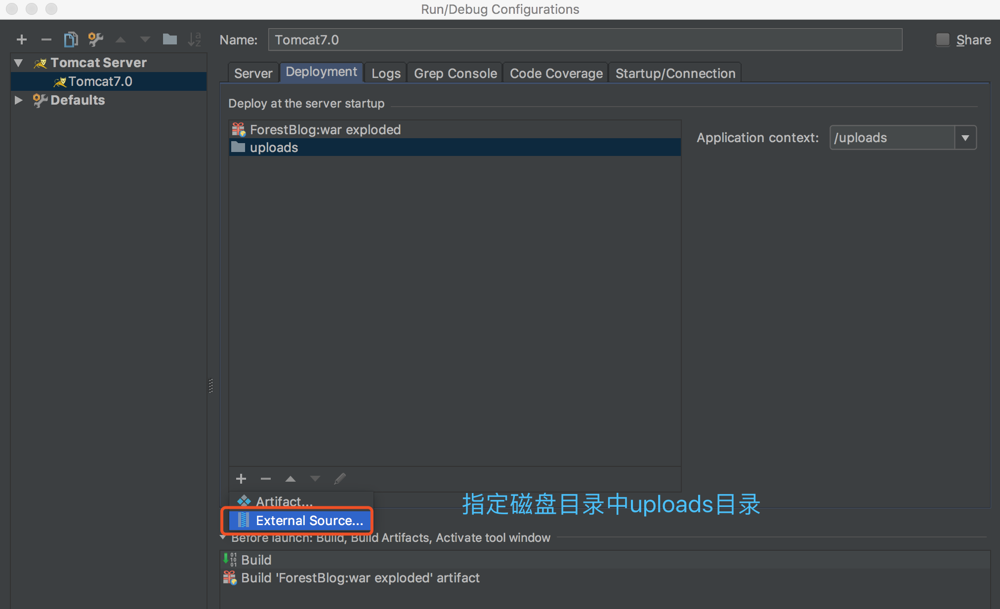

最新消息，博主已开通B站账号：[Java刘哥](https://space.bilibili.com/160340478)
## 博主开发的其他博客或论坛项目全部在这里
**[全部原创项目](https://liuyanzhao.com/shop.html)**   <br/>
**[https://liuyanzhao.com/shop.html?k=博客](https://liuyanzhao.com/shop.html?k=博客)**   <br/>
**[https://liuyanzhao.com/shop.html?k=论坛](https://liuyanzhao.com/shop.html?k=论坛)** 	<br/>
- ------------------------------------------------------------
# 关于项目
该博客是基于SSM实现的个人博客系统，适合初学SSM和个人博客制作的同学学习。<br/>
博主已写了一篇该项目的毕业论文和录制了2个小时的代码讲解可以供大家学习，需要的可以联系博主，微信847064370。<br/>

主要涉及技术包括的包括 Maven、Spring、SpringMVC、MyBatis、JSP、MySQL等。 <br/>
详细介绍：[https://liuyanzhao.com/6347.html](https://liuyanzhao.com/6347.html) <br/>
预览地址：[http://forestblog.liuyanzhao.com](http://forestblog.liuyanzhao.com) <br/>

前台效果图  <br/>

<br/>
后台效果图  <br/>

<br/>
后台地址：/admin 或者 /login <br/>


## 使用注意
#### 1.开发工具的选择
请使用 IntelliJ IDEA, 尽量不要用 Eclipse/MyEclipse，使用前者项目起不来我可以帮忙解决，后者直接忽视(理论上可以起)

#### 2.确保你安装了 Maven
从官网下载 Maven，并配置阿里云镜像，IDEA 或 Eclipse 里需要设置 Maven 的 settings.xml 。

#### 3.请安装 Lombok 插件
代码中多次使用 `@Data` 注解，请确保你的 IDE 安装了 `Lombok` 插件，否则找不到 getter/setter 方法。如果你的 lombok 无效，可能是 pom.xml 里的 lombok 版本和你安装的lombok 版本相差较大。<br/>
无论是 Eclipse 还是 IDEA 都需要安装 lombok。

#### 4.项目首页没有文件夹名称
确保 tomcat 配置中 `application context` 是 /，而不是 /ForestBlog。这是导致你们首页css样式全无的原因，因为引用css路径都是 /xxx/xxx.css


## 使用步骤
任何问题都可以联系我 <br/>
简单的我可以直接口头回复你，复杂的可以有偿远程帮你。<br/>
Q Q：847064370 <br/>
微信：847064370 <br/>
在线留言：[https://liuyanzhao.com/message.html](https://liuyanzhao.com/message.html)

#### 1、克隆项目  <br/>
克隆或者下载项目到本地，解压，主要分为三个部分：ForestBlog、uploads 和 forest_blog.sql <br/>
ForestBlog: 完整项目源码, 可以使用 IDEA 导入或者打开，记得要导入里面那个 ForestBlog项目，即 pom.xml所在的父目录。  <br/>
uploads: 上传图片的目录，与源码分离开来，可以放到物理磁盘某一目录，如D盘某目录，后面会讲 <br/>
forest_blog.sql: 数据库文件，请先创建数据库，然后以运行sql文件方式导入 <br/>

#### 2.使用 IDEA 导入Maven项目
确保你安装了 Maven，导入项目时，选择已存在的项目，类型是 Maven 项目。<br/>
等待Maven下载完依赖，或者手动点击刷新，如果无法下载请检查 Maven 配置和切换网络，多次尝试。 <br/>
导入完成后，如果出现Java类里红色报错，多半是 Lombok 插件没有安装。


#### 3、 导入数据库   <br/>
新建数据库 `forest_blog`，导入数据库（即forest_blog.sql）。注意，数据库的编码和排序规则是utf-8和utf-8_general_ci  <br/>


#### 4、修改项目中的数据库连接信息   <br/>
修改 `db.properties` 文件，该文件很容易找到，在 src/main/resources 中<br/>
里面有 MySQL, 请确保已安装和启动 MySQL <br/>
注意修改数据库地址、表名、用户名和密码。<br/>
否则项目无法启动

 
#### 5、配置 tomcat 和 uploads 目录   <br/>
该项目是 SSM 项目，没有启动类，需要通过 tomcat 来运行。无论是 Eclipse 还是 IDEA 都很容易。<br/>
这里主要说一下上传目录映射问题：<br/>
该项目中，文件上传是传到本地，且和项目文件夹不在一起，就是说是源码和上传目录是分离的。 <br/>
比如我们把 uploads 目录放到 E盘根目录(建议直接把我的那个uploads文件夹拷贝到D盘根目录)，比如有一张图片路径是 `D:/uploads/2017/10/avatar.jpg`, 我们想在项目中以 `http://loclahost:8080/uploads/2017/10/avatar.jpg ` 方式访问，需要以下两步：<br/>

1、 修改 UploadFileController.java 中上传路径，需要修改 rootPath 为你指定的 uploads 目录，如 `String rootPath ="D:/uploads/";` <br/>
如果不修改，会出现无法上传失败；<br/>

2、为 tomcat 设置 uploads 映射。<br/>
-  IDEA 操作如下：<br/>
在 tomcat 配置中 Deployment 里面添加，如图



- Eclispe 操作如下：<br/>
在 Server/server.xml 的 </Host> 前面添加
```
<Context path="/" docBase="项目路径，不需要改" debug="0" reloadable="true" />
<Context path="/uploads" docBase="D:/uploads/" debug="0" reloadable="true" />
```
- Linux 服务器环境部署

在 tomcat/conf/server.xml 的 Host 标签内添加如下代码 <br/>
```
<Context path="/" docBase="项目路径如 /www/server/tomcat/webapps/ForestBlog" debug="0" reloadable="true" />
<Context path="/uploads" docBase="/www/uploads" debug="0" reloadable="true" />
```

如果不修改，会出现uploads的图片无法加载，无法显示上传目录的图片

 
## 下载地址：
Github地址：https://github.com/saysky/ForestBlog
（如果可以帮忙点一次Star和Fork）
 
## 更新记录
- 2021年02月25日
- 第三次大更，修复部分Bug，新增用户注册、用户管理等功能

- 2018年11月26日
- 第二次大更，重新规范了代码，完善了注释

- 2017年10月10日
- 首次完整提交

## 广告
插条广告：博主长期接毕设定制，软件定制，Java问题解决 <br/>
具体查看[有偿服务](https://liuyanzhao.com/notice/my-service.html)  <br/>
博主付费商品：[https://liuyanzhao.com/shop.html](https://liuyanzhao.com/shop.html)


